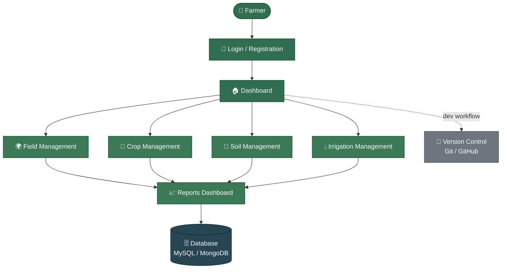

# 🌾 FarmVerse

**Precision Agriculture Management Platform**

> **Group:** Group D
> **Author:** Shirisha Regoti

---

## 📋 Table of Contents

- [Problem Statement](#-problem-statement)
- [Proposed Solution](#-proposed-solution)
  - [Key Modules](#key-modules)
  - [How It Solves the Problem](#how-it-solves-the-problem)
- [System Architecture](#-system-architecture)
  - [Flow Description](#flow-description)
- [Database Schema](#-database-schema)
- [Technologies Used](#-technologies-used)

---

## 🧩 Problem Statement

Most farmers still depend on manual, paper-based methods to track their day-to-day operations — noting field details, crop cycles, soil conditions, and watering schedules by hand or from memory rather than through any structured system.

Without a centralized digital system, this way of working leads to:

- ⏱️ **Time-consuming, error-prone record-keeping** — field, crop, soil, and irrigation details logged inconsistently across notebooks and memory
- 👁️ **Poor visibility into farm operations** — no single place to see how a field, crop, or irrigation schedule is progressing
- 💧 **Inefficient resource use** — irrigation and soil-care decisions made without organized, up-to-date data to guide them
- 📉 **Delayed, less-informed decisions** — scattered records make it hard to review trends or compare data across fields and seasons
- 📊 **Difficulty tracking crop and soil health over time** — no easy way to look back at how a field or crop cycle has performed

> [!IMPORTANT]
> There is a clear need for an integrated digital platform — **FarmVerse** — that centralizes field, crop, soil, and irrigation records in one place, replacing scattered manual processes with structured, easily accessible data that helps farmers manage operations more efficiently and make better-informed decisions.

---

## 🚀 Proposed Solution

**FarmVerse — Precision Agriculture Management Platform** is a web-based application that digitizes farm management. It replaces scattered paper records and guesswork with a single, structured system that a farmer can log into and manage every aspect of their farm from — field data, crop details, soil health, irrigation schedules, and performance reports.

The system enables farmers to:

- ✅ Register and log in securely
- ✅ Manage field information
- ✅ Record crop details
- ✅ Monitor soil health
- ✅ Schedule irrigation activities
- ✅ View reports and farm statistics
- ✅ Maintain all farming records digitally

This helps improve productivity, reduce manual work, and support better farming decisions.

> [!TIP]
> Every module — Field, Crop, Soil, and Irrigation — feeds into one central **Reports Dashboard**, so a farmer never has to piece together data from separate notebooks or apps.

### Key Modules

| Module | Description |
|---|---|
| 🔐 **Login / Registration** | Secure farmer authentication and account creation, forming the entry point to the platform |
| 🏠 **Dashboard** | A central hub summarizing farm status at a glance, with navigation into each management module |
| 🌍 **Field Management** | Add, update, and track field-level details such as location, area, and soil type |
| 🌱 **Crop Management** | Record crop type, sowing/harvest dates, and growth stage for each field |
| 🧪 **Soil Management** | Log and monitor soil health indicators (pH, nutrients, moisture) to guide farming decisions |
| 💧 **Irrigation Management** | Plan and schedule irrigation activities per field to avoid over- or under-watering |
| 📈 **Reports Dashboard** | View consolidated reports and farm statistics drawn from all modules for better decision-making |

### How It Solves the Problem

| Problem | FarmVerse Solution |
|---|---|
| Fragmented information | Single dashboard consolidating field, crop, soil, and irrigation data |
| Inefficient resource use | Structured irrigation scheduling per field to avoid over/under-watering |
| Lack of predictive insight | Reports dashboard surfaces trends and statistics from farm records |
| Limited access to expertise | Soil and crop tracking gives farmers structured data to make informed decisions |
| Paper-based, error-prone records | All field, crop, soil, and irrigation records maintained digitally |
| Low technology adoption | Simple web-based login, dashboard, and guided modules for ease of use |

---

## 🏗️ System Architecture

FarmVerse follows a straightforward flow: the farmer logs in, lands on a central dashboard, and from there accesses five core management modules. Every module reads from and writes to a shared database, keeping all farm records in one place.

### Flow Description

- **Farmer** — The end user of the system, accessing FarmVerse through a web browser.
- **Login / Registration** — Entry point for authentication; new farmers register, returning farmers log in securely.
- **Dashboard** — Central hub after login, providing navigation to all management modules and a summary view of the farm.
- **Field / Crop / Soil / Irrigation Management** — Four independent modules for recording and updating field details, crop information, soil health data, and irrigation schedules.
- **Reports Dashboard** — Consolidates data from all modules into farm statistics and reports for the farmer to review.
- **Database (MySQL / MongoDB)** — All modules persist and retrieve data from a central database — MySQL for structured relational records, with MongoDB as an alternative/complementary store for flexible or document-style data.
- **Version Control (Git/GitHub)** — Shown alongside the main flow since it isn't part of the runtime request path — it's the source-code management tool used throughout development.

---

## 🗄️ Database Schema

The data model is document-oriented, designed for **MongoDB**, and centered on eight core collections — **Users, Farms, Fields, Crops, Crop Cycles, Soil Records, Irrigation Schedules, and Reports**. Related records are linked using referenced ObjectIds (e.g., a Field document references its parent Farm, and a Soil Record or Irrigation Schedule references its Field), giving the flexibility of a schema-less store while keeping the entities below organized the way a relational design would.

### 👤 Users

| Column | Type | Notes |
|---|---|---|
| user_id | UUID / INT (PK) | Primary key |
| name | VARCHAR(100) | Full name |
| email | VARCHAR(100) | Unique |
| phone | VARCHAR(15) | Unique |
| password_hash | VARCHAR(255) | Encrypted |
| role | ENUM | Farmer / Agronomist / Admin / Buyer |

### 🚜 Farms & Fields

| Column | Type | Notes |
|---|---|---|
| farm_id | UUID / INT (PK) | Primary key |
| user_id | FK → Users | Owner |
| farm_name | VARCHAR(100) | — |
| total_area_acres | DECIMAL | — |
| field_id | UUID / INT (PK) | Primary key (Fields table) |
| field_name / soil_type / area_acres | VARCHAR / DECIMAL | Field-level attributes |

### 🌾 Crops & Crop Cycles

| Column | Type | Notes |
|---|---|---|
| crop_id | INT (PK) | Primary key |
| crop_name / category | VARCHAR | e.g., Wheat, Cereal |
| ideal_temp_range / soil_ph | VARCHAR / DECIMAL | Reference values |
| cycle_id | UUID / INT (PK) | Primary key (CropCycles table) |
| field_id / crop_id | FK | Links field to active crop |
| sowing_date / expected_harvest_date | DATE | — |
| actual_yield_kg / status | DECIMAL / ENUM | Planned / Growing / Harvested |

### 🧪 Soil Management

| Column | Type | Notes |
|---|---|---|
| soil_record_id | UUID / INT (PK) | Primary key |
| field_id | FK → Fields | Field being monitored |
| ph_level | DECIMAL | Soil pH reading |
| moisture_pct | DECIMAL | Soil moisture percentage |
| nitrogen / phosphorus / potassium | DECIMAL | NPK nutrient levels |
| recorded_at | TIMESTAMP | Date/time of reading |

### 💧 Irrigation Management

| Column | Type | Notes |
|---|---|---|
| irrigation_id | UUID / INT (PK) | Primary key |
| field_id | FK → Fields | Field to be irrigated |
| scheduled_date | DATE | Planned irrigation date |
| duration_minutes | INT | Duration of irrigation |
| water_volume_liters | DECIMAL | Water used |
| status | ENUM | Scheduled / Completed / Skipped |

### 📊 Reports

| Column | Type | Notes |
|---|---|---|
| report_id | UUID / INT (PK) | Primary key |
| user_id | FK → Users | Report owner |
| report_type | ENUM | Yield / Soil / Irrigation / Summary |
| period_start / period_end | DATE | Reporting period covered |
| generated_at | TIMESTAMP | When the report was generated |
| summary_data | JSON / TEXT | Aggregated statistics for the period |

> [!NOTE]
> Referential integrity between linked collections (e.g., Fields → Farms, Crop Cycles → Fields/Crops, Soil Records → Fields, Irrigation Schedules → Fields, Reports → Users) is enforced at the **Spring Boot service layer**, with cascading deletes applied where child records are lifecycle-bound to a parent.

---

## 🛠️ Technologies Used

| Layer | Technology / Tools |
|---|---|
| **Frontend** | HTML5, CSS3, JavaScript, React.js *(Recommended)* |
| **Backend** | Java, Spring Boot, Spring Web (REST APIs), Hibernate/JPA |
| **Database** | MySQL, MongoDB |
| **Development Tools** | Visual Studio Code, Git & GitHub, Postman (API Testing), MongoDB Compass |
| **Cloud (Optional)** | MongoDB Atlas (Cloud Database) |

---
